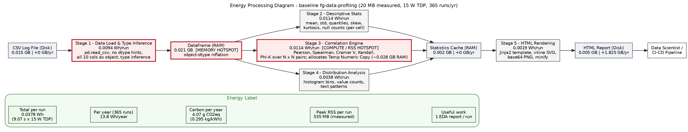
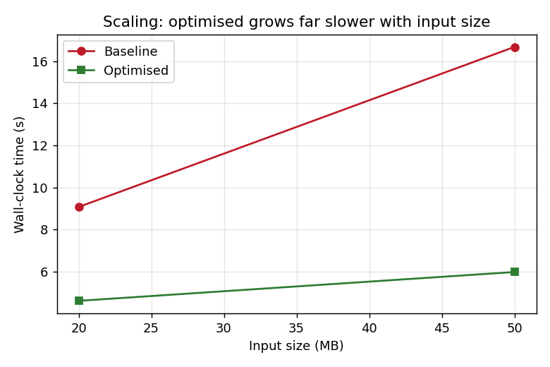

# How We Cut an EDA Tool's Energy Use by Up to 64% — Without Touching Its Code

*By Keerthana Yelchuru Venkata and Sriyan Ravuri | Group 14, NWI-IMC019 Green Software, Radboud University*

---

Every day, thousands of data scientists drop a CSV into a profiling tool and get back a beautiful report — distributions, correlations, missing-value summaries, all in one click. It's wonderfully convenient. But what does that convenience cost in energy and carbon?

That question drove our semester project in the Green Software course at Radboud University. Our subject was **fg-data-profiling** (the community successor to the well-known *pandas-profiling* / *ydata-profiling* library, at [github.com/Data-Centric-AI-Community/fg-data-profiling](https://github.com/Data-Centric-AI-Community/fg-data-profiling)) — a tool with ~13,600 GitHub stars that runs inside tens of thousands of data pipelines worldwide.

Our finding: **49–64% of its energy and runtime can be cut with fewer than ten lines of code, purely from the caller side, without changing what the report contains.**

---

## The hidden cost of "just works"

When you call `pd.read_csv("data.csv")` with no extra arguments, Pandas plays it safe. Not knowing what's in your file, it stores string columns as Python `object` — roughly **50 bytes per cell**, because each value becomes a full Python object — and defaults numbers to `int64`/`float64` even when half the space would do.

For a 20 MB CSV, those defaults inflated the in-memory table to **20.7 MB** of RAM just for loading, and that bloated table then flowed into every downstream computation.

We found this by building an **Energy Processing Diagram (EnPD)** — a map of where energy flows through the pipeline — and instrumenting each stage with `tracemalloc` and `psutil`. The diagram pointed straight at the data-load layer as the dominant memory hotspot.


*EnPD for the baseline pipeline (20 MB input, 15 W server, 365 runs/year). Red borders mark the memory hotspot (data load) and the compute hotspot (correlation engine).*

---

## The fix: tell Pandas the truth

The fix was conceptually simple — instead of letting Pandas guess, we declared exactly what the data contains and dropped the columns the report never uses.

```python
df = pd.read_csv(
    path,
    usecols=["timestamp", "method", "endpoint", "status_code",
             "response_time_ms", "bytes_sent", "region"],   # drop 3 unused
    dtype={"status_code": "int16", "response_time_ms": "float32",
           "bytes_sent": "int32", "method": "category",
           "endpoint": "category", "region": "category"},
)
```

This applies three strategies from van Gastel's *Strategies for Green Software* infographic: **C5 (algorithm to data)** — load only the 7 needed columns, never decoding the 3 high-cardinality or irrelevant ones; **D6 (improve algorithms)** — `category` dtype stores each repeated string once and represents rows as 1-byte integers; and **C3/D3 (store less, fewer interactions)** — a smaller table also means fewer pairwise correlations (21 instead of 45).

---

## The numbers

We ran the **full** end-to-end pipeline — `ProfileReport(explorative=True).to_file()`, including the correlation engine and HTML rendering — on two dataset sizes, three runs each, measuring time, memory, and energy via CodeCarbon.

| Metric | 20 MB | 50 MB |
|---|---|---|
| Wall-clock time | −49.2% (9.07 → 4.61 s) | −64.1% (16.67 → 5.98 s) |
| Measured energy (CodeCarbon) | −48.7% | −63.9% |
| DataFrame load memory | **−88.3%** (20.7 → 2.4 MB) | **−88.7%** (50.4 → 5.7 MB) |
| Process peak RSS | −9.8% | −8.6% |
| Output correctness | ✓ identical | ✓ identical |

The scaling behaviour is the most striking result: the optimised variant barely grows with input size (4.6 → 6.0 s for 2.5× the data), while the baseline grows steeply (9.1 → 16.7 s). **The larger the dataset, the bigger the relative win.**


*Wall-clock time vs. input size. The gap widens in the regime that matters — production data.*

One honest caveat: while load memory fell 88%, the full pipeline's peak memory dropped only ~9%. ProfileReport's correlation and HTML-rendering stages allocate hundreds of megabytes regardless of input dtypes — they set the ceiling. A load-only measurement would have hidden this, which is exactly why we measured the whole pipeline.

---

## What it means in practice

On a CI/CD server (15 W, European grid, one 50 MB run per day), the savings look like this:

| | Per run | Per pipeline/year | 10,000 pipelines |
|---|---|---|---|
| Energy saved | 160 J | **16.2 Wh** | 162 kWh |
| CO₂eq avoided | — | **4.8 g** | **48 kg** ≈ 300 km in a petrol car |

Per pipeline this sounds tiny. But fg-data-profiling runs in tens of thousands of automated pipelines, and these savings compound every single day.

---

## Why `category` changes everything

For the curious: a `category` column stores its unique values once and represents each row as an integer index into that list. For an `endpoint` column with 200 unique values across 100,000 rows, the `object` dtype allocates 100,000 Python strings; `category` allocates 200 strings plus 100,000 one-byte integers — roughly 50× less memory. Crucially, groupby and correlation then run on integers instead of string comparisons, which is why *time* fell too, not just memory.

We explored four further levers too: configuration tuning (`minimal=True`, −72%), 25% row sampling (−67% memory), CSV → Parquet (−95% load time), and result caching (99.98% avoided on a cache hit). And one honest negative result: exporting JSON instead of HTML, which we expected to be cheaper, was 23% *slower* and used twice the memory. Wrong intuitions are worth documenting.

---

## The broader lesson

The optimisation needed no changes to fg-data-profiling, no algorithmic redesign, and no new dependencies — just *telling Pandas the truth about the data upfront*. This pattern recurs across green software: library defaults are tuned for safety and generality, not efficiency. If your pipeline reads CSVs without `dtype=` and `usecols=`, you're paying a memory and energy tax you don't need to. Ten lines. Real savings. Every run.

---

*Written for NWI-IMC019 Green Software at Radboud University, 2025–2026.*

*For the full scientific report — methodology, EnPD, energy calculations, and references — see [the full report (PDF)](report.pdf).*
